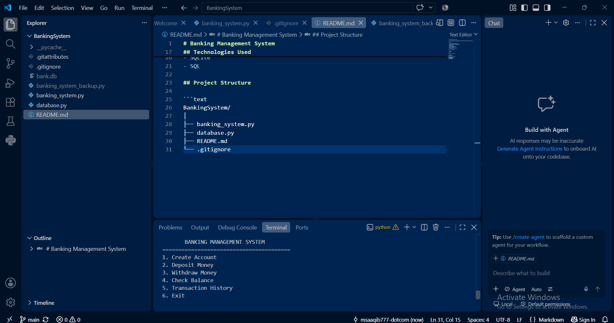
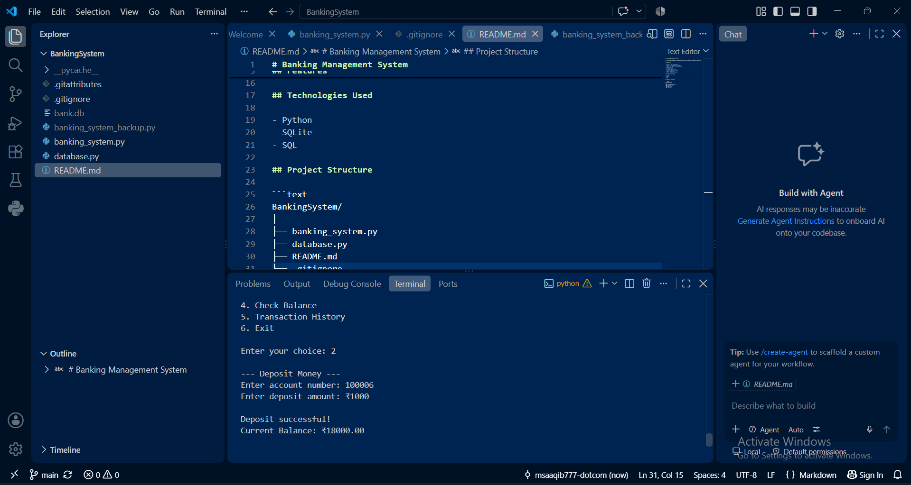
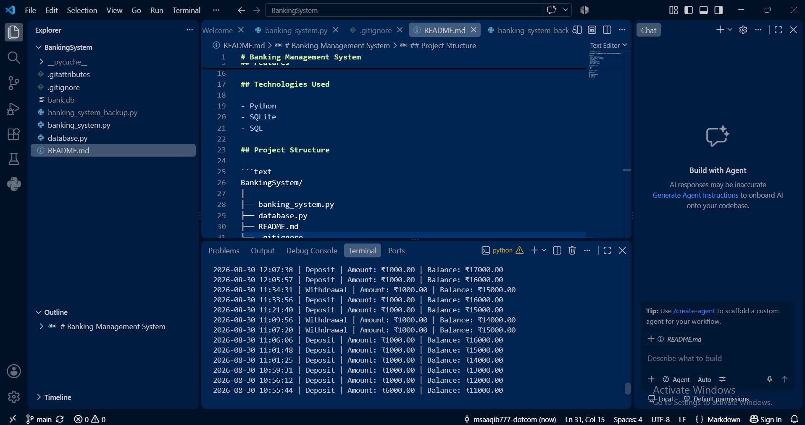

# Banking Management System

A console-based Banking Management System developed using Python and SQLite.

## Features

- Create a new bank account
- Generate unique account numbers
- Create and confirm a 4-digit PIN
- Deposit money
- Withdraw money
- Check account balance
- View transaction history
- Input validation
- SQLite database storage

## Technologies Used

- Python
- SQLite
- SQL

## Project Structure

```text
BankingSystem/
│
├── banking_system.py
├── database.py
├── README.md
└── .gitignore
## Screenshots

### Main Menu


### Deposit Money


### Transaction History
